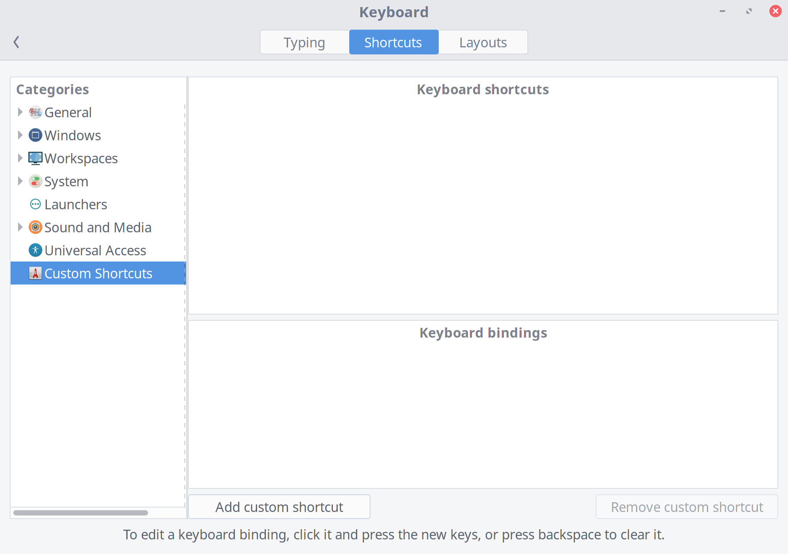

# Cinnamon Shortcuts

The Cinnamon desktop environment has a number of built-in shortcuts for manipulating the system's resolution, switching workspaces, and launching applications. Mastery of these shortcuts will greatly reduce the amount of time spent clicking around menus and potentially boost your productivity.

**NOTE**: We will not cover all of the available shortcuts. You can look at the Keyboard menu discussed below in order to see them all. This article will cover some of the ones you are most likely to use.

**NOTE on Key Terminology**: 

 * If your keyboard came from a Mac, the `Alt` key might be labeled `Option` instead.
 * If your keyboard came from a Mac, you likely have a `Command` key. If you have a Windows-based keyboard, you likely have a Windows key. These keys are referred to in the Linux world as the `Super` key (or `Meta` key in emacs and a few other contexts)

## Changing the Default Shortcut Keybindings

We will be discussing the shortcuts as they exist on a freshly-installed instance of Korora Cinnamon. However, if you would like to change the default shortcuts to better suit your keyboard or workflow, you are free to do by opening the Keyboard settings application, which can be reached by navigating through the following menu path: 
**Menu -> Preferences -> Keyboard -> Shortcuts**
or
**Menu -> Preferences -> System Settings -> Hardware -> Keyboard -> Shortcuts**

 

## Emergency Shortcuts

### Launch a Console Terminal

If Cinnamon becomes unresponsive or you need to otherwise access a text-only console terminal outside of the window manager, enter the following command:

    Ctrl + Alt + F2

You can switch back to the GUI by hitting:

    Ctrl + Alt + F1

### Restart Cinnamon

If Cinnamon has become buggy or unusable, you can try restarting it via the following:

    Ctrl + Alt + Escape

### Shut Down

    Ctrl + Alt + End

## Session Shortcuts

### Lock Screen

    Ctrl + Alt + L

**NOTE**: On GNOME and some other desktop environment's (including Windows), locking the screen is usually `Super + L`, however in Cinnamon this launches the Cinnamon debugger, Melange.

### Log Out of Current Session

    Ctrl + Alt + Delete

## Workspace Shortcuts

**NOTE**: You can have as many workspaces as you like. When the documentation refers to moving "left" or "right", it means referring to the workspace immediately to the left or right of your current workspace. For example, if you are currently on Workspace 3, moving to the left workspace would switch you to Workspace 2. Moving to the right would shift you to Workspace 4, etc.

### Switch to left workspace

    Ctrl + Alt + Left Arrow

### Switch to right workspace

    Ctrl + Alt + Right Arrow

### Send current window to left workspace

    Ctrl + Alt + Shift + Left

### Send current window to right workspace

    Ctrl + Alt + Shift + Right

## Launchers

### Launch the GNOME Terminal

**NOTE**: This is different from launching the console terminal as this is still within the GUI. The GNOME Terminal can be moved around and minimized at will.

    Ctrl + Alt + T

### Launch Nemo File Manager

    Super + E

## Window Management

### Cycle between open windows / applications

To cycle from left to right, use:

    Ctrl + Tab

To cycle in the reverse direction, use:

    Ctrl + Shift + Tab

### Cycle between open instances of the same application

By default `Alt + Tab` to cycle open windows will lump all instances of an application together. If you wish to cycle through those clumps of the same application (e.g. multiple File windows, multiple instances of Firefox, etc.), use the following command:

    Alt + Grave (`)

### Show Desktop

    Super + D

### Snap current window to left side of screen

    Super + Left

### Snap current window to right side of screen

    Super + Right

### Snap current window to top of screen

    Super + Up

### Snap current window to bottom of screen

## Screenshots

### Take a Screenshot

    Print / PrtScr

### Take Screenshot of the Current Window

    Alt + PrtScr

### Take Screenshot of Selected Area

    Shift + Print

### Record the Desktop

    Shift + Ctrl + Alt + R